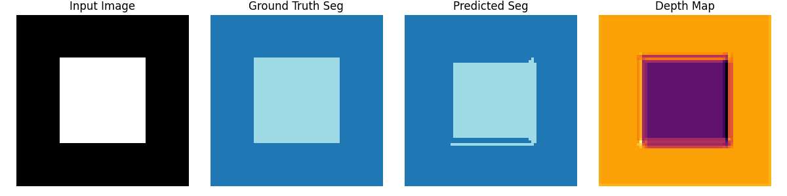

# Per-Camera-Proof-of-Concept-(PoC)
Per-Camera Proof-of-Concept (PoC) deep learning system capable of simultaneous object detection, segmentation, and depth estimation from synthetic camera images. It demonstrates the feasibility of integrating multiple vision tasks into a lightweight neural network, providing a foundation for future research in real-time multi-task perception for camera-based systems. The project also includes a visualization pipeline for inspecting input images, ground-truth annotations, and model predictions for debugging and evaluation purposes.

---

## Objectives
- Generate synthetic dataset with images, segmentation masks, and depth maps.
- Implement a compact neural network (`TinyPerCameraNet`) for simultaneous object detection, segmentation, and depth estimation.
- Provide a configurable training pipeline with checkpoints.
- Enable visualization of input images, ground-truth masks, predicted segmentation, depth maps, and bounding boxes.
- Establish modular and reusable code for scaling to real datasets.

---

## Scope
### In Scope
- Synthetic dataset generation for controlled experiments.
- Model training and evaluation on synthetic data.
- Artifact generation: input images, segmentation masks, depth maps, and detection predictions.
- Basic visualization for debugging and result analysis.

### Out of Scope
- Deployment on real-world multi-camera systems.
- Integration with robotics or autonomous platforms.
- Advanced model architectures beyond the lightweight PoC.

---

## Deliverables
- Synthetic dataset with images, segmentation masks, and depth maps.
- Trained model checkpoint (`TinyPerCameraNet`).
- Prediction results and visualization artifacts.
- Project documentation including methodology and KPIs.

---

## Sample Visualization test

---

## Key Performance Indicators (KPIs)
- **Segmentation mIoU:** TBD (Mean Intersection over Union on synthetic dataset)
- **Detection AP:** TBD (Average Precision for bounding boxes)
- **Depth RMSE:** TBD (Root Mean Squared Error for predicted depth maps)
- **Training Loss:** Monitor average loss during training
- **Artifact Generation:** Successful saving of images, masks, depth maps, and predictions

---

## Timeline
| Phase | Duration |
|-------|----------|
| Synthetic Dataset Generation | 1 week |
| Model Implementation | 1 week |
| Training & Checkpoint Saving | 1 week |
| Visualization & Debugging | 1 week |
| Documentation & Packaging | 1 week |

---

## Assumptions
- Synthetic data sufficiently represents the problem domain for PoC purposes.
- Hardware supports PyTorch training on CPU or GPU.
- Python 3.10+ and required packages are installed.

---

## Risks
- Synthetic data may not generalize to real-world data.
- Model may overfit due to small dataset.
- Segmentation and detection outputs may be inconsistent due to lightweight architecture.

---

## Next Steps
- Replace synthetic dataset with real camera data for further validation.
- Scale model architecture for improved segmentation and detection accuracy.
- Extend visualization module to show multiple predictions and comparison metrics.
- Integrate evaluation metrics directly into training pipeline.

---
